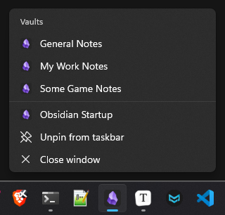
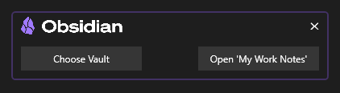

# Obsidian Startup

A simple Windows program that helps to better manage Obsidian's startup phase. One of the biggest complaints I've had is that it doesn't support Windows Jump Lists when you right click the shortcut on the taskbar. This helps to improve that by providing its own jumplists, and also prompts you when you try to launch it so you can choose to either launch the most recent vault, or launch the vault chooser.

## Installation

The program is a Standalone application does not require any installation. Simply move it a folder where it can sit, and then run it. Once the program has been launched (and you see a prompt), you can right-click the icon on the Taskbar and select "Pin to Taskbar". You can download the [latest version here](https://github.com/flamewave000/ObsidianStartup/releases/latest), or you can build it yourself.

## Jump List

The jump lists are regenerated each time the app is launched, so you may not see anything initially until the app is run. Also, changes to your vaults will not be reflected until the app is re-run again.

The Jump List displays your vaults in alphabetical order.

## Prompt When Launched

If a vault has been "recently opened", this will prompt you when launching to ask if you want to open the recent one, or open the Vault Chooser.

## Caveats

So the caveats to using this program as your launcher are as follows *(at least the ones I can think of right now)*:

1. You have to have a separate program on your taskbar or in your start menu for launching Obsidian. This means you will see the Obsidian Startup's icon in addition to the Obsidian App's icon on your taskbar.
2. The Jump lists are not reactive. They only update on the next launch of Obsidian Startup. This means changes to your vaults are only reflected the next time the Obsidian Startup program is run.

## Building

- Clone the repository.
- Open the solution file "Obsidian Startup.sln" in Visual Studio.
- Right Click the "Obsidian Startup" Project in the Solution Explorer.
- Select "Publish"
- On the document window that opens, click the big "Publish" button.
- You will find the published executable at `<project_root>\bin\Release\net6.0-windows\publish\win-x86\Obsidian Startup.exe`. You can ignore the `Obsidian Startup.pdb` file as that is just Debug symbols that you don't need.

## Language

If you would like to use a different language, you will need to build the application yourself with the updated strings. You will find the English strings in the `Resources\Stringresource.xaml` file. Simply modify those strings and build the project.

